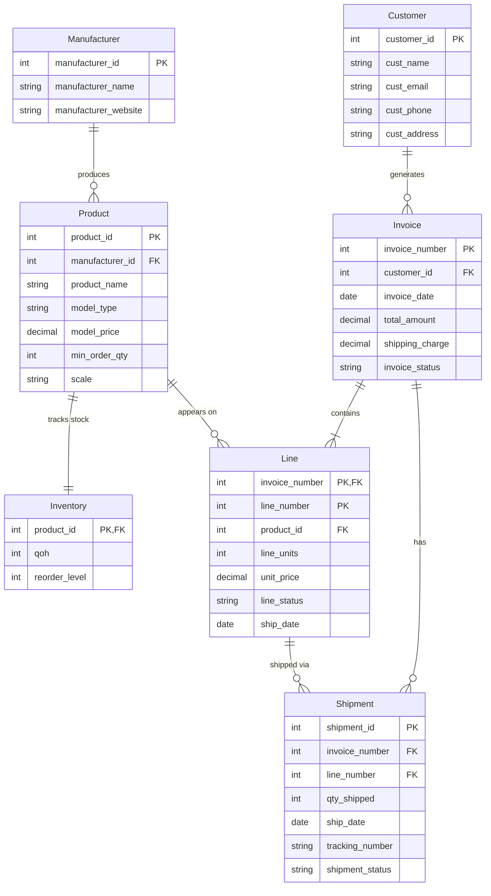

# Model Shop Entity Relationship Diagram

## Notes

### Entity Details
- All IDs are unique and non-null integers
- Phone numbers must be 10 digits
- Prices and amounts must be >= 0
- Units and quantities must be positive integers

### Enum Values
- `invoice_status`: Open, Partially Shipped, Closed
- `line_status`: Backordered, Partial, Fulfilled
- `shipment_status`: Created, Shipped, Delivered
- `model_type`: Car, Aircraft, Ship, Decal
- `scale`: 1/144, 1/100, 1/72, 1/48, 1/35, 1/32, 1/24

### Key Business Rules
1. Invoice acts as order header (no separate order table)
2. Shipment handles partial deliveries
3. Inventory triggers reorder when qoh ≤ reorder_level
4. Line table snapshots prices at order time
5. Credit card processing is external
6. `qty_shipped` cannot exceed `line_units`
7. Shipment date must be ≥ invoice date